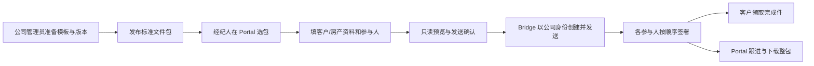

# 公司标准文件包与个性化签署：两阶段 Plan

历史快照（2026-09-13）。当前独立文件与文件包实现见 [9 月 15 日更新](2026-09-15-independent-signing-packages.md)。以下部署状态仅代表当时记录。

**第一阶段只提供公司标准文件包：公司提供并持有模板和文件，经纪人在 Portal 选择场景、填写资料、指定参与人并发送；需要签署的人使用自己的签署链接，最后取回整包。经纪人和客户均不需要为这类任务开通 Documenso 账号。**

个性化 PDF 是独立的第二阶段，先做可行性验证，再决定是否提供。不会为了标准包先建设逐人开户、SSO 或个性化编辑器。用户附带的另一份 AI 建议与截图属于设计参考，其中的能力判断已另行核对，未当作代码现状或执行授权。

## 0. 实施结果与剩余条件

| 能力 | 当前结果 |
|---|---|
| 公司上传自己的 PDF | `/admin/signing` 已支持多 PDF 上传至公司模板；管理员配置字段/角色后发布。上传不发邀请 |
| 公司拥有标准包 | 新 buyer/seller（含 Listing/直接买家变体）使用对应公司连接，不再依赖经纪人原生连接 |
| 经纪人准备 | 选已发布包，填写一位/两位客户姓名邮箱及交易信息；经纪人/公司签署角色由模板决定 |
| 确认后发送 | Portal 只读显示真实 PDF、预填及待签字段；查看所有文件后确认，Bridge 校验审阅 hash、模板和原 PDF 一致性 |
| 无账号客户回签 | 本地真实 Documenso 2.18.0 已完成多人签署；最后一位客户用 390×844 手机视口完成两份 PDF，未创建账号 |
| 完成件 | Portal 逐份下载及 ZIP；ZIP 保留原生已封存 PDF、完成证明、审计及 SHA-256 目录，不改写签署件 |
| 隔离 | 同公司 A/B、公司授权、停用身份、伪造管理员、客户签署链接和原生编辑器越权均有服务端校验及测试 |
| 恢复与规模 | 拒签/撤销/完成后重新准备；过期提醒续期；unknown 防重复；615 条稳定分页及失败 webhook 退避已验证 |
| 第二阶段入口 | 经纪人个人上传、custom 请求、原生编辑入口和新建个人连接均已关闭；历史任务仍按原连接读取 |

实施分支：两个仓库均为 `codex/company-standard-packages`。Portal 基于 `8d053d9`，eSign 基于 `db66095`；eSign 改动位于独立 worktree `/private/tmp/esign-company-standard-packages`，没有修改原仓库的当前 checkout。

现在剩下的是：**公司提供正式 PDF → 我配置各页字段和角色、建立人数/场景变体 → 公司确认条款及角色规则 → 用正式模板再验收 → 部署并受控开放。** 不能把合成文件验证等同于正式买家/卖家包已经上线。完整证据及边界见[第一阶段验收记录](../qa/2026-09-13-company-packages/README.md)。

## 1. 两阶段范围与所有权

| 场景 | 谁准备模板/文件 | Native 文件持有人 | 经纪人操作 | 经纪人原生账号 |
|---|---|---|---|---|
| 入职 / Team Leader | 公司 | 公司现有身份 | Portal 准备/签署，按原流程处理 | 不需要；保留现有流程 |
| 第一阶段：买家、卖家、Listing、Listing 对直接买家等标准包 | 公司统一发布、维护版本 | 对应公司身份 | Portal 选包、填资料、预览、发送、跟进、下载；本人需要签时走 recipient 链接 | 不需要 |
| 第二阶段候选 A：个性化 PDF 嵌入编辑 | 经纪人上传，公司控制文件空间 | 公司身份 | Portal 内打开仅限本任务的原生嵌入编辑器 | 有望不需要；完整权限边界尚待验证 |
| 第二阶段候选 B：个性化原生工作台 | 经纪人 | 映射的经纪人原生用户/团队，业务归公司 | 进入独立原生空间编辑，再回 Portal | 需要真实绑定与生命周期；SSO 不能消除这些后台账号 |

第一阶段明确使用公司模式，不设置“先连接你的签署账号”前置条件。公司服务凭证只由服务端使用，经纪人不会拿到公司密码、API token 或公司工作台会话。

**公司所有权、经纪人任务归属、实际签署人是三个不同维度。** 公司可以持有文件但不是签署人；经纪人可以准备并发送文件，但只有包明确要求其签名时才加入签署角色。公司管理员也不能因为有管理权限就替客户或经纪人签字。

## 2. 本次重新确认的代码与部署事实

Portal HEAD `8d053d9`；eSign HEAD `db66095`。对照了现有 Bridge、Portal 及与生产版本一致的官方 Documenso 源码 `389390c884949fe27c240488a3259da3cdba93e0`（2.18.0）。

### 两个网址不是同一个服务的两个登录入口

| 入口 | 2026-09-13 Azure 只读实查 | 结论 |
|---|---|---|
| `documenso.kevv.ai` | `ca-documenso-kevvesign-dev`，开发资源组，镜像 `documenso/documenso:v2.11.0`，独立开发 Key Vault 数据库引用 | 仍运行的旧开发实例，不能直接承接当前 Portal 生产任务 |
| `esign.kevv.ai` | 原域名进入 Nginx gateway，再到 `ca-documenso-kevvesign-prod`；官方 2.18.0 固定镜像 | 当前 Portal 签署引擎 |
| Portal → Bridge | 生产 `ca-esign-bridge-prod`；代码只有一个 `DOCUMENSO_BASE_URL` | 当前没有按个性化/标准包选择两套原生实例的路由 |

两个页面都显示邮箱/密码/Passkey 登录，没有公开注册入口；Azure 配置均关闭公开注册及 OIDC 登录。它们使用不同部署环境和数据库密钥引用；本次没有读取数据库连接串或比较实际库内容，不能因为登录页相同就认定账号、组织、文件、webhook 互通。

现有代码没有找到用户口述 `Documentflow.cap.ai` 的配置；结合用户提供的明确链接，本 Plan 针对 `documenso.kevv.ai` 核对，不猜测其他域名。

建议第二阶段仍优先复用同一生产 2.18.0 引擎的能力。使用旧实例会增加版本适配、账号与 webhook 路由、历史文件定位和运维成本。是否保留、升级或关闭旧实例另行处理，本次不改其运行状态。

部署实查摘要见[核对记录](/Users/weizhengle/Downloads/vibecoding/homixliving/docs/plans/evidence/2026-09-13-company-packages-review.json)；现行拓扑见 [eSign 部署文档](/Users/weizhengle/Downloads/vibecoding/esign/docs/DEPLOYMENT.md)。

### 实施前的差距与本次修正

基线 `db66095` 的 targetConnection 仅将 onboarding/team_leader 路由到 company；buyer/seller/custom 都查 ownerAgentId 对应 customer connection。本次已将 buyer/seller 标准包路由到发布模板所属公司的连接，并在 Bridge 与 Portal 两层限制公司授权；custom 新建关闭。

原生 editorUrl 仍只是路径，没有登录凭证交换。本次仅允许公司管理员配置公司模板，标准包任务不向经纪人提供 editor。Bridge 尚未实现逐人创建用户、建团队、首次登录和离职回收。Portal 使用 Auth.js/Google 登录，并不是现成的 OIDC 身份提供方。

此前将“普通经纪人未连接原生账号”列为标准包上线阻碍，是基于旧实现的判断；**新需求下应改造路由，取消该依赖，而非给所有经纪人开户。**

## 3. 第一阶段用户流程

复用现有 `/signing` 和 `/admin/signing`，不新增平行工作台。经纪人只看到公司发布且适用于自己的场景；无房产的买家首次合作允许先签，不强制填不存在的地址。

准备信息不是签名。如果包需要“经纪人先签，客户后签”，用原生 recipient signingOrder 配置；若只是经纪人先填写，则填好后确认发送即可，不增加虚构的经纪人签名步骤。

同一阶段、同一收件范围的多份 PDF 放入**一个 native 模板、一个主 part**。每位参与人拥有自己的入口，可连续完成该包所有文件。每张表一个 part 会产生独立任务与邀请；跨 part 目前没有自动依赖，严格顺序使用同一 envelope 内 routing。不同受众的 LA 协议和客户文件应分别编包，不能把私人材料发给不相关参与人。

### 公司需要准备的包清单

以下是配置场景，不是未经审核的法律文件清单。沿用 buyer/seller 基础 scenario，通过 packageKey/selectors 区分交易阶段和房产类型，不为每个显示名称新增一套后端流程。

| 标准包 | 公司发布时必须明确 |
|---|---|
| 买家首次合作 | 独家/非独家选择、公司、期限、约定报酬、一/两位买家、经纪人是否签及顺序 |
| 卖家 / Listing 委托 | 房产类型、业主数量、委托协议与适用披露、客户需填写的事实、公司是否续签 |
| Listing 对直接买家的文件包 | 实际代理关系、阶段、参与人、需签文件与顺序；不能仅因“自己的买家”自动判断法律关系 |
| 公司指定的其他固定包 | 如 LA 佣金或出价阶段，明确受众、责任人与适用条件；只有公司审定并发布后才显示 |

每包交付一份 manifest：companyKey、packageKey、版本、生效/停用状态、场景条件、最终 PDFs 及顺序、角色与人数、签署顺序、每页字段位置、必填/可选/只读、Portal 预填映射、通知与完成件收件范围。

第一轮先完成公司最先确认的买家与住宅卖家两包作为验收样板；同次工作为 Listing 对直接买家等已提供的正式包使用同一机制配置。未提供/未审定的包保留待准备状态，不能显示为可发送。不得以只完成两包为理由，把本阶段已有正式材料的其他标准场景自动推迟到个性化阶段。

公司一次性在原生模板中定位字段，经纪人不需要摆签名框、改条款或管理模板。首版按一/两人明确变体，避免空白签署人；同一人承担多种责任时明确是否可合并角色，不制造两个无法区分的签署槽位。旧资料库的表格观察见[历史研究](/Users/weizhengle/Downloads/vibecoding/homixliving/docs/plans/2026-09-12-client-signing-research.md)，发布以公司最终提供文件为准。

## 4. 第一阶段已落实的设计与实现要求

### P1-1：公司路由与权限模型

- 将 buyer/seller 标准包路由到与已发布包一致的公司连接，保留 clientId、companyKey 和 ownerAgentId。source 模板与 target 公司一致，不接受前端指定任意 connection/native user/team。
- `ownerAgentId` 仍由 Portal 服务端从当前有效经纪人身份写入，代表业务任务负责人，不再等于 Native 文件持有人。列表、详情、原件/成品/ZIP、签署入口、提醒、撤销及重新准备每个入口都校验 request 归属；part/item 必须属于该 request。
- 公司适用范围在后端验证。明确经纪人当前可使用哪家公司；如果允许跨公司操作，使用明确授权，不只依赖下拉框。
- Native 继续使用公司受控身份和团队。第一阶段可以复用现有每公司连接；普通经纪人不加入公司/HR native team、不获得工作台入口。公司空间中的 HR 和客户任务由 scenario/package/业务权限区分。
- 目前每 companyKey 只允许一个有效 company connection。若未来要把公司 HR 与客户文件放进不同原生团队，需要增加 purpose 维度和历史 connection 绑定迁移；这是公司级配置，不是逐人开户，也不是首发必需条件。
- 保留普通管理员的管理与审计能力，但“可以管理任务”不授予冒充任一 recipient 的签署权。团队负责人也不因团队关系默认获得下属客户文件。

### P1-2：解除 HR 规则与 company scope 的混用

本次同时调整以下位置，避免只改路由后仍把公司连接等同于 HR：

| 现有位置 | 必须一起调整 |
|---|---|
| service `detail` 的 canEdit | 当前只排除 HR，标准公司包应明确禁止原生 editor；直接调用 access 也必须拒绝 |
| `syncPart` 的公司 recipient 校验 | 保留公司标准包角色不可被悄悄替换的保护，使用适用于标准包的命名/错误，不把客户状态投影成入职 |
| `command(send)` | 把 HR 的模板/草稿/原件一致性检查扩展到所有公司标准包；不能用 company scope 决定是否享有入职专属撤销规则 |
| `access(signer)` | 依据实际角色、当前邮箱、任务归属与签署顺序验证。客户通常直接用自己的原生邀请；经纪人可以签自己的角色，不能索取其他客户链接 |
| company recipient | 公司账号只是持有人时不自动加入 SIGNER；确实需要公司签时，固定为审定的公司签署身份 |
| HR 回调与台费 | 继续依据 scenario 路由，标准包完成不触发入职签完、付款或账户激活 |

本次复用 `assertHrDraft` 校验受控客户模板草稿，覆盖原 PDF hash、角色、字段、预填和 routing；保留旧函数名兼容 HR，业务判断按 scenario 区分。

### P1-3：Portal 固定包准备与预览

- 公司包只提供结构化填写，复用当前角色/业务 key 合并与选项检查。固定条款不能由经纪人替换；无权限公司和未发布版本不能进入发送。
- 当前 preview 只有文件名和收件人汇总，实际 PDF 检查依赖原生 editor。移除 editor 后要补只读 PDF 审阅和预填核对，不能让用户在看不到文件内容的情况下确认发送。
- 预览展示本次锁定版本的 PDF 与按同一 snapshot 定位的预填信息；不提供拖字段/改 PDF 功能。签名和客户待填写项明确为空。若原生 original 下载不包含预填，使用仅预览的字段叠加，不能把空白原件冒充已填成品。
- 预览→确认发送绑定同一份 snapshot。修改信息后重新确认；已发送文件不能原地覆盖。发送结果不明保持幂等保护，查明原远端后再行动。
- 普通经纪人的自定义上传入口本阶段关闭/隐藏，服务端同样关闭新 custom 请求与 editor 授权，不能只藏按钮。保留现存任务查看/成品和管理员处理能力，不删除旧文件。

### P1-4：完成、跟进、恢复与整包取回

- 修正客户签后 redirect：标准包不跳到需要经纪人登录的 Portal 详情，优先使用原生完成页；验证本人已签但他人未签的等待状态，以及全部完成后的通知和领取。
- Portal 用现有 Bridge 查询/webhook/对账展示逐人进度和最终状态，不把浏览器 Finish 当成整包已完成。完成件、证明与审计沿用原生文件。
- 经纪人可以在任务中下载有意义名称的各文件与整包 ZIP；ZIP 保留所有原 PDF 字节及证明/目录，不重新合并重写已封存 PDF。客户领取其有权查看的包，不能依赖经纪人转发其他人的签署链接。
- 补“按此包重新准备”与前次任务关系，覆盖拒签/撤销后的新 attempt；复制资料不复制签名。过期先验证原生提醒/续期语义。创建/发送 unknown 先查远端，不能直接重复邀请。
- 已移除最近 500 条截断，使用数据库筛选、精确计数和 `(updated_at,id)` 稳定排序；失败 webhook 与待同步任务按下次尝试时间退避，避免前一批失败阻塞后续记录。615 条分页和 101 条失败 webhook 后的健康事件已实测。

### P1-5：发布和现有数据

已有 HR 包、公司连接、HR 回调保持兼容。现存请求按保存的 connection_id 原样读取，不批量改成公司 owner、不移动签署件。新标准包才按公司模式创建；旧的个人持有 buyer/seller 任务保留历史路径和受控处理。

模板修改用复制后发布新版本；停用只限制新任务。对已准备但未发送的旧版本制定明确策略：公司撤回后阻止新发送，引导重新准备，不静默替换合同。

先部署兼容 company-standard 的 Bridge，再部署相应 Portal 和入口开关，最后发布审定模板并放开试点。回退首先关闭新建/发送入口，保留在途签署查询和完成件；不能把已发出的公司任务重定向到个人空间或旧开发实例。

## 5. 第一阶段必须通过的验收

| 验收 | 通过标准 |
|---|---|
| 无原生账号的经纪人 A/B | 两人在 Portal 均能准备和发送公司包，不创建个人 native 连接 |
| 同公司隔离 | A 不能通过列表、猜 request/part/item、下载/ZIP、提醒、恢复访问 B 的任务；未登录/停用用户被拒 |
| 公司与 HR 边界 | 不能改 companyKey/模板越权；公司标准包没有 editor；伪造 access 请求也被拒；客户任务不改 HR 状态 |
| 多人一包 | 买家、卖家、经纪人、公司等只按实际包角色出现；顺序、双人变体、每人邀请和逐页字段正确 |
| 正式 PDF | 每页签名/initial/date/文本/勾选无遗漏；预填、No/Unknown/NA、长文本与只读条款正确；预览对应发送版本 |
| 客户无账号 | 桌面与手机完成邀请→阅读→签署→等待→领取，不落到 Portal 登录页 |
| 取回文件 | 所有人完成后，客户与经纪人均得到完整可读 PDF；Portal ZIP/证明可用且与原生完成件字节一致 |
| 准备不发送 | 保存与预览不发邮件；只有确认发送才分发。双击、超时与重启不重复邀请 |
| 终态恢复 | 拒签/撤销后创建有来源的新任务；旧签名不带入；过期与 unknown 有明确恢复路径 |
| 入职回归 | 公司邀请、个人推荐、团队加入仍可完成原流程，HR 签署、真实台费和激活事实保持正确 |

本次已增加公司持有客户包的真实原生引擎/Portal HTTP/手机浏览器验证，Bridge 契约测试扩展到 14 个。正式包未提供，所以只称“第一阶段机制准备完成”。正式文件逐页字段验收和生产邮件、付款、上线后冒烟仍需在相应环境执行；本次没有重新支付真实台费。

顺序签署要求每位非 CC 参与人使用不同序号；Documenso 2.18.0 的同序号分组存在邀请与轮次判断不一致，发布时已阻止。可选择所有人并行。一个客户包只发布一个含多 PDF 的原生模板；一人/两人使用审定变体，不在发送时删除已发布的固定角色。

## 6. 本轮移出范围的事项

- 经纪人逐人开户、API token 配置、SSO/自动登录和离职回收。
- 个性化 PDF、自定义签名框编辑、管理员代处理上传的临时产品流程。截图里的“上传后管理员代发”只是备选，用户本次未选择，不纳入第一阶段。
- 新 CRM、资料库深度编排、request→deal 数据模型、客户事件驱动的交易自动归档、交易清单自动勾选。
- 旧开发实例升级/迁移/关闭，以及双原生实例路由。

上述交易/资料库整合保留在未来待办，但**不再是这次公司标准包的发布条件**。第一阶段的“整包取回”仍保留：签署工作台可追踪并取得完成文件。资料库可继续作为公司准备模板的来源，发布管理复用现有界面。

## 7. 第二阶段：先证明低维护路径，再决定是否做个性化

### 优先验证：单任务嵌入式编辑，不进入完整原生后台

官方 2.18.0 已有 `create-presign-token`、`EmbedUpdateEnvelope` 及 `scope: envelopeId:<id>`。与当前“返回普通原生编辑 URL”不同，这种凭证用于嵌入编辑，不是公司账号登录会话。它有机会实现：Portal 上传 → Bridge 用公司身份建立草稿 → 核验 ownerAgentId → 发仅限该任务的短时编辑凭证 → 原生组件在 Portal 内布置字段 → 返回 Portal 核对和发送。

这是候选方案，不是现成的安全能力声明。本次发现：编辑页面和 update 校验 envelope scope，但 create 路由调用 token verifier 时没有传 scope，verifier 仅在双方均有 scope 时比较。因此**不能仅设置 scope 就认定整个原生 API 已限于一个文件**。第一步必须检查带 scope token 是否仍能创建别的文档、调用其他类型入口或执行非预期动作；不是仅做 A 改 B 的页面测试。本次没有对生产进行利用或发送。

原生嵌入 UI 的隐藏选项是体验控制，不替代后端权限。范围至少包含 token 到期与退出/离职后的剩余有效期、直接接口调用、跨文件访问、编辑/发送权限、配置与公司资料暴露、编辑后收件人一致性、邮件不得在 Portal 确认前发送。

官方现行文档将嵌入编辑列为 Enterprise/Platform 相关功能；固定版本代码中的检查又受部署配置影响。因此正式选择前核实这套自托管部署的适用授权和成本，不能仅凭源码可调用就承诺免费。参考[官方嵌入编辑说明](https://docs.documenso.com/docs/developers/embedding/editor)。

若权限边界需要维护大量上游补丁，或不能保持公司身份下的文档隔离，就不走公司共享嵌入凭证路线。最多先做 1–2 个工作日的合成验证，再形成明确 go/no-go，不拖累第一阶段。

### 备选：真实隔离账号 + 原生登录/SSO

如果必须进入完整原生后台，就要为每位经纪人建立真实用户/隔离团队，Bridge 保存 canonical Portal agent ↔ native user/team/instance 的绑定。凭证分配只是其中一步，还包括幂等开通、邀请/身份验证、团队权限、webhook、邮箱变更/合并、停用与历史文件接管。

Documenso 支持 OAuth/OIDC，但当前两个实例都关闭 OIDC；Portal 的 Google/Auth.js 会话不能直接兑换为原生会话。可以研究共同身份提供方或已有 Google 身份登录，保留真实 native 用户；无法保证“点击即无感登录”，必须验证首次授权、多账号选择、会话到期及 return URL。不能共享管理员 cookie、拼一个被上游不认识的 JWT 或复用公司密码来模拟自动登录。参考[官方身份配置](https://docs.documenso.com/docs/self-hosting/configuration/environment)。

这条路线明显增加维护。若单任务嵌入不能通过验证，而用户仍不愿维护原生账号，则保持个性化功能关闭；公司标准包照常提供。当前不承诺建设新的 Portal PDF 字段编辑器。

## 8. 后续执行顺序

| 顺序 | 工作 | 产出 |
|---|---|---|
| 已完成 | 公司路由/隔离、公司上传、结构化准备、预览、发送、手机回签、完成包、恢复、分页/退避 | 本地机制及合成验证完成 |
| 下一步 | 公司给最终 PDF、适用公司与场景、谁签及顺序、必填/预填规则 | 每个包的审定配置清单 |
| 然后 | 配置签名/initial/date/文本/勾选字段及人数变体，发布测试版本 | 我配置，公司确认条款和角色规则 |
| 正式验收 | 每页与长文本、选择项、A/B 隔离、多人/手机完成件检查 | 每套正式包验收记录 |
| 上线 | 先 Bridge，再 Portal；检查私有存储、PDF.js 资源和公司配置，最后发布审定包并试点 | 生产实际邀请与完成件冒烟后逐步开放 |
| 第二阶段另开 | 单任务嵌入可行性 → 授权/隔离结论 → 决定是否做个性化 | go/no-go 与单独排期 |

此前 5–8 / 8–12 工作日估算包含本轮已完成的基础改造，不再代表剩余工作量。剩余配置量取决于 PDF 页数、签署角色、条件字段和人数变体；收到文件后逐包估算，不先承诺所有包同日上线。

上传 PDF 之后仍需配置并审核字段与版本，不能直接把空白文件当成可签包发布。第二阶段不计入第一阶段交付。

## 9. 文档与验证边界

本次已修改 Portal 与 eSign Bridge 业务代码，并在本地独立数据库、Documenso 2.18.0、私有 S3 模拟存储和 Mailpit 中运行合成测试。测试文件均标明非合同，收件地址为 `example.invalid`，没有向真实客户发信或签正式合同。生产部署、旧开发实例、生产账号与模板未改动。正式上线部署另行执行。

当前 Plan 替代[本轮调整前的上线复核](/Users/weizhengle/Downloads/vibecoding/homixliving/docs/plans/archive/2026-09-13-client-signing-readiness-before-company-owned-scope.md)。更早的[9 月 12 日原计划](/Users/weizhengle/Downloads/vibecoding/homixliving/docs/plans/archive/2026-09-12-client-signing-packages-before-documenso-review.md)和表格研究保留供追溯，不作为当前账号要求或必做清单。

官方固定版本源码参考：[presign 入参](https://github.com/documenso/documenso/blob/389390c884949fe27c240488a3259da3cdba93e0/packages/trpc/server/embedding-router/create-embedding-presign-token.types.ts)、[token 核验](https://github.com/documenso/documenso/blob/389390c884949fe27c240488a3259da3cdba93e0/packages/lib/server-only/embedding-presign/verify-embedding-presign-token.ts)、[create 路由](https://github.com/documenso/documenso/blob/389390c884949fe27c240488a3259da3cdba93e0/packages/trpc/server/embedding-router/create-embedding-envelope.ts)、[update 路由](https://github.com/documenso/documenso/blob/389390c884949fe27c240488a3259da3cdba93e0/packages/trpc/server/embedding-router/update-embedding-envelope.ts)。本次在对应 commit 的本地官方 checkout 中读取，未改源码。
